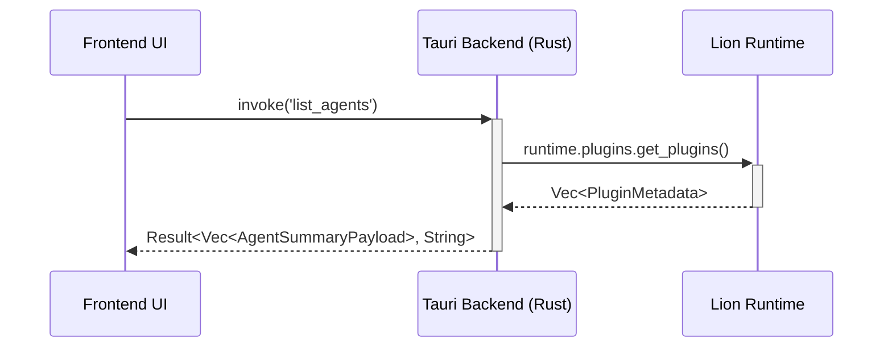

# LionForge IDE - Design Document: [Feature Name]

**Version:** 1.0 **Date:** [Date] **Author(s):** @Designer **Status:** Draft /
Proposed / Approved / Implemented

## 1. Introduction & Goals

_(Describe the feature or component being designed. What problem does it solve?
What are the high-level goals? Reference Phase Goals or Orchestrator task
inputs.)_

### 1.1. Goals

- Goal 1...
- Goal 2...

### 1.2. Non-Goals

- Non-goal 1...
- Non-goal 2...

## 2. Proposed Design

_(Detailed technical specification.)_

### 2.1. Backend Design (Rust / Tauri Core)

- **State:** Describe any new or modified shared state needed in the Tauri
  backend (e.g., additions to `Arc<Runtime>` or new `tauri::State`).
- **Tauri Commands:** Define new or modified `#[tauri::command]` functions.
  Include:
  - Full function signature (name, async, arguments with types, return type
    `Result<PayloadType, String>`).
  - Description of what the command does.
  - Required Lion capabilities (if any).
  - Key interactions with `lion_runtime` subsystems (`plugins`, `capabilities`,
    `workflows`, etc.).
  - Potential error conditions and how they map to the `String` error return.
- **Tauri Events (Backend -> Frontend):** Define new or modified events emitted
  by the backend. Include:
  - Event name (string literal).
  - Payload struct definition (implementing `Clone, Serialize`).
  - When/why the event is emitted.
- **Internal Logic/Modules:** Describe any new Rust modules or significant logic
  changes required within the Tauri backend.

```rust
// Example Command Definition
#[derive(serde::Serialize, serde::Deserialize, Clone)]
struct AgentSummaryPayload {
    id: String,
    name: String,
    state: String,
}

#[tauri::command]
async fn list_agents(runtime: tauri::State<'_, Arc<lion_runtime::Runtime>>) -> Result<Vec<AgentSummaryPayload>, String> {
    // 1. Call runtime.plugins.get_plugins().await
    // 2. Map PluginMetadata to AgentSummaryPayload
    // 3. Handle errors, map to String
    // ... implementation details ...
}

// Example Event Definition
#[derive(serde::Serialize, serde::Deserialize, Clone)]
struct AgentStatusUpdatePayload {
    id: String,
    new_state: String,
}
// Backend emits: app_handle.emit_all("agent_status_changed", AgentStatusUpdatePayload { ... })
```

### 2.2. Frontend Design (React / TypeScript)

- **Components:** List new or significantly modified React components. Describe:
  - Purpose/Responsibility.
  - Key props (with types).
  - Internal state management (if significant).
  - API calls (`invoke`) made.
  - Event listeners (`listen`) handled.
- **State Management:** Describe changes to global state (e.g., new Zustand
  store slice, reducers/actions if using Redux).
- **API Client (`api.ts`):** List new or modified functions wrapping `invoke`
  calls, including request/response types.
- **Data Flow:** Briefly describe how data flows from backend events or API
  calls through the state manager to the relevant UI components.
- **(Optional) UI Mockups/Wireframes:** Link to or embed simple diagrams if
  helpful (Mermaid can be used).

```typescript
// Example API Client Function
interface AgentSummary {
  id: string;
  name: string;
  state: string;
}
async function listAgents(): Promise<AgentSummary[]> {
  return await invoke("list_agents");
}

// Example Component Outline
/**
 * AgentListView Component
 * Purpose: Displays a table of loaded agents.
 * Props: None (fetches data itself or via global state)
 * State: `agents: AgentSummary[]`, `isLoading: boolean`, `error: string | null`
 * API Calls: `listAgents()` on mount.
 * Event Listeners: `agent_status_changed` (updates the specific agent's state in the list).
 */
```

### 2.3. Data Models (If Applicable)

_(Define any new or modified data structures used for persistence (e.g., in
`lionforge.toml`) or significant state management.)_

### 2.4. Architecture Diagram (Optional)

_(Use Mermaid to show component interactions, data flow, or sequence diagrams if
the design is complex.)_



## 3. Security Considerations

_(How does this feature interact with Lion's capabilities or policies? What
capabilities does the backend command need? Are any new security risks
introduced? How are they mitigated?)_

## 4. Performance Considerations

_(Are there potential performance bottlenecks? How will large amounts of data
(e.g., logs, many agents) be handled efficiently in the UI and backend?)_

## 5. Alternatives Considered

_(Briefly list other design approaches considered and why the proposed design
was chosen.)_

## 6. Open Questions

_(List any unresolved questions or areas needing further clarification or
research.)_
