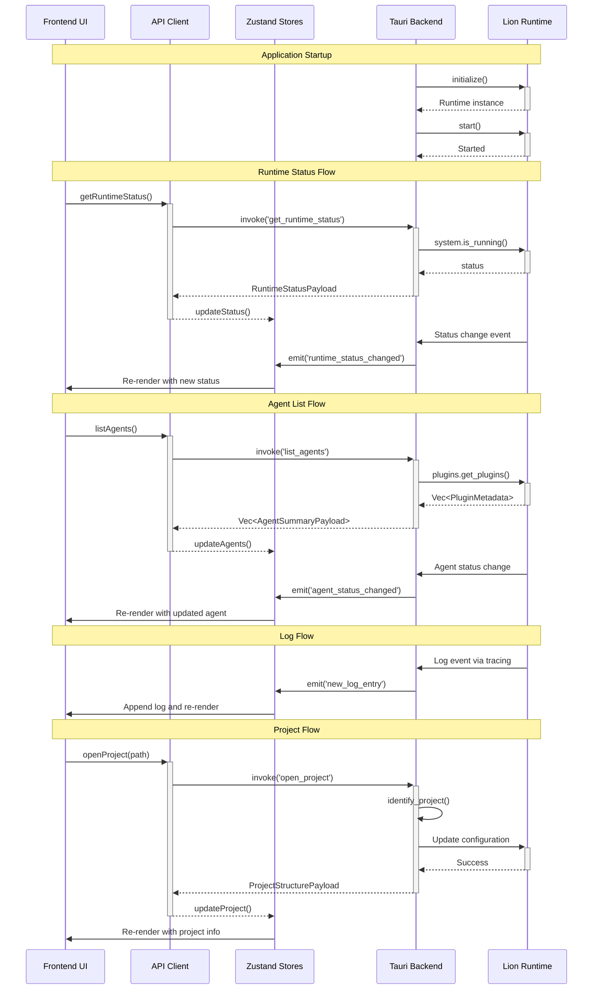

# LionForge IDE - Design Document: Stage 3 Phase 1 - Foundation, Runtime Connection & Read-Only Views

**Version:** 1.0 **Date:** 04/03/2025 **Author(s):** @Designer **Status:** Proposed

## 1. Introduction & Goals

This design document outlines the implementation of Stage 3 Phase 1 of the LionForge IDE, which focuses on establishing the basic Tauri application structure, integrating the Lion runtime lifecycle, connecting the UI to the runtime for essential status information, and providing read-only views for core entities (Agents, Logs). This phase will prove the core Tauri <-> Rust communication and display live data.

### 1.1. Goals

- Establish a robust Tauri application structure with proper lifecycle management
- Integrate the Lion runtime with proper initialization, startup, and shutdown
- Create a responsive UI with standard IDE layout (sidebar, main area, bottom panel, status bar)
- Implement read-only views for Agents and Logs with real-time updates
- Enable project selection and basic project structure display
- Ensure proper error handling and status reporting throughout the application

### 1.2. Non-Goals

- Editing or creation of agents, workflows, or other entities (deferred to later phases)
- Advanced filtering or search capabilities for logs or agents
- Complex project management features beyond basic folder structure display
- Performance optimizations beyond basic responsiveness requirements
- Full plugin management capabilities (beyond listing and status display)

## 2. Proposed Design

### 2.1. Backend Design (Rust / Tauri Core)

- **State:** The Tauri backend will maintain the following shared state:
  - `Arc<lion_runtime::Runtime>`: The core Lion runtime instance
  - `Arc<RwLock<ProjectState>>`: Current project information (path, structure)
  - `Arc<LogBuffer>`: Circular buffer for recent log entries

```rust
/// Project state information
#[derive(Debug, Clone, Default)]
pub struct ProjectState {
    /// Root path of the current project
    pub root_path: Option<String>,
    /// Project name (from lionforge.toml or directory name)
    pub name: Option<String>,
    /// Standard folders found in the project
    pub folders: Vec<String>,
    /// Whether the project is currently loaded in the runtime
    pub is_loaded: bool,
}

/// Circular buffer for storing recent log entries
pub struct LogBuffer {
    entries: RwLock<VecDeque<LogEntry>>,
    max_size: usize,
}
```

- **Tauri Commands:**

```rust
/// Get the current runtime status
#[tauri::command]
async fn get_runtime_status(runtime: tauri::State<'_, Arc<Runtime>>) -> Result<RuntimeStatusPayload, String> {
    // 1. Check if runtime is running via runtime.system.is_running()
    // 2. Get uptime if available
    // 3. Return RuntimeStatusPayload with status information
    // 4. Map errors to String
}

/// List all agents/plugins in the runtime
#[tauri::command]
async fn list_agents(runtime: tauri::State<'_, Arc<Runtime>>) -> Result<Vec<AgentSummaryPayload>, String> {
    // 1. Call runtime.plugins.get_plugins().await
    // 2. Map PluginMetadata to AgentSummaryPayload
    // 3. Handle errors, map to String
}

/// Get recent log entries
#[tauri::command]
async fn get_recent_logs(log_buffer: tauri::State<'_, Arc<LogBuffer>>) -> Result<Vec<LogEntry>, String> {
    // 1. Read from the log buffer
    // 2. Return the most recent entries (up to a limit)
}

/// Identify a project directory and analyze its structure
#[tauri::command]
async fn identify_project(
    path: String,
    project_state: tauri::State<'_, Arc<RwLock<ProjectState>>>
) -> Result<ProjectStructurePayload, String> {
    // 1. Check if directory exists
    // 2. Look for lionforge.toml and standard folders
    // 3. Update project_state with new information
    // 4. Return ProjectStructurePayload with project details
}

/// Open a project and load it into the runtime
#[tauri::command]
async fn open_project(
    path: String,
    runtime: tauri::State<'_, Arc<Runtime>>,
    project_state: tauri::State<'_, Arc<RwLock<ProjectState>>>
) -> Result<ProjectStructurePayload, String> {
    // 1. Call identify_project to get project structure
    // 2. Update runtime configuration based on project
    // 3. Update project_state with loaded status
    // 4. Return updated ProjectStructurePayload
}
```

- **Tauri Events (Backend -> Frontend):**

```rust
/// Runtime status update event
#[derive(Clone, Serialize)]
struct RuntimeStatusUpdate {
    is_running: bool,
    uptime_seconds: Option<u64>,
    status_message: String,
}
// Emitted when runtime status changes: app_handle.emit_all("runtime_status_changed", payload)

/// Agent status update event
#[derive(Clone, Serialize)]
struct AgentStatusUpdate {
    id: String,
    name: String,
    new_state: String,
}
// Emitted when an agent's state changes: app_handle.emit_all("agent_status_changed", payload)

/// New log entry event
#[derive(Clone, Serialize)]
struct LogEntry {
    id: String,
    timestamp: String,
    level: String,
    message: String,
    source: String,
    metadata: Option<serde_json::Value>,
}
// Emitted when a new log is captured: app_handle.emit_all("new_log_entry", payload)
```

- **Internal Logic/Modules:**

1. **Runtime Integration (`runtime.rs`):**
   - Handles initialization, startup, and shutdown of the Lion runtime
   - Sets up event listeners for runtime status changes
   - Manages the runtime lifecycle during application startup/shutdown

2. **Logging System (`logging.rs`):**
   - Implements a custom `tracing::Subscriber` to capture logs
   - Maintains the log buffer and emits log events to the frontend
   - Provides filtering and formatting capabilities

3. **Project Management (`project.rs`):**
   - Handles project identification and structure analysis
   - Manages the project state and configuration loading
   - Provides utilities for working with project files and directories

4. **Agent Monitoring (`agents.rs`):**
   - Monitors agent/plugin status changes in the runtime
   - Emits agent status update events to the frontend
   - Provides utilities for working with agent metadata

### 2.2. Frontend Design (React / TypeScript)

- **Components:**

1. **App Layout (`src/components/layout/AppLayout.tsx`):**
   ```typescript
   /**
    * Main application layout component
    * Purpose: Provides the overall IDE layout structure
    * Props: None
    * State: None (container only)
    * Children: Sidebar, MainArea, BottomPanel, StatusBar
    */
   ```

2. **Status Bar (`src/components/statusbar/StatusBar.tsx`):**
   ```typescript
   /**
    * Status bar component
    * Purpose: Displays runtime status and other system information
    * Props: None
    * State: Uses runtimeStatusStore from Zustand
    * API Calls: None (uses store data)
    * Event Listeners: None (store handles events)
    */
   ```

3. **Project Explorer (`src/components/sidebar/ProjectExplorer.tsx`):**
   ```typescript
   /**
    * Project explorer component
    * Purpose: Displays project folder structure in a tree view
    * Props: None
    * State: Uses projectStore from Zustand
    * API Calls: None (uses store data)
    * Event Listeners: None (store handles events)
    */
   ```

4. **Agent List View (`src/components/agents/AgentListView.tsx`):**
   ```typescript
   /**
    * Agent list component
    * Purpose: Displays a table of loaded agents with their status
    * Props: None
    * State: Uses agentStore from Zustand
    * API Calls: None (uses store data)
    * Event Listeners: None (store handles events)
    */
   ```

5. **Log View (`src/components/logs/LogView.tsx`):**
   ```typescript
   /**
    * Log viewer component
    * Purpose: Displays system logs with auto-scrolling
    * Props: None
    * State: Uses logStore from Zustand
    * API Calls: None (uses store data)
    * Event Listeners: None (store handles events)
    * Features: Auto-scrolling, clear button, level-based coloring
    */
   ```

6. **Main Area (`src/components/main/MainArea.tsx`):**
   ```typescript
   /**
    * Main content area component
    * Purpose: Container for the main content area (welcome screen initially)
    * Props: None
    * State: None (container only)
    * Children: WelcomeScreen or other content based on application state
    */
   ```

7. **Bottom Panel (`src/components/panel/BottomPanel.tsx`):**
   ```typescript
   /**
    * Bottom panel component with tabs
    * Purpose: Container for tabbed panels (Logs, Agents, etc.)
    * Props: None
    * State: activeTab: string
    * Children: LogView, AgentListView
    */
   ```

8. **Welcome Screen (`src/components/main/WelcomeScreen.tsx`):**
   ```typescript
   /**
    * Welcome screen component
    * Purpose: Initial screen shown when no project is open
    * Props: None
    * State: None
    * API Calls: openProject() when "Open Project" button is clicked
    */
   ```

- **State Management:**

Using Zustand for global state management with the following stores:

1. **Runtime Status Store (`src/stores/runtimeStatusStore.ts`):**
   ```typescript
   interface RuntimeStatus {
     isRunning: boolean;
     uptimeSeconds?: number;
     statusMessage: string;
   }
   
   interface RuntimeStatusStore {
     status: RuntimeStatus;
     isInitializing: boolean;
     error: string | null;
     updateStatus: (status: RuntimeStatus) => void;
     fetchStatus: () => Promise<void>;
   }
   ```

2. **Agent Store (`src/stores/agentStore.ts`):**
   ```typescript
   interface AgentSummary {
     id: string;
     name: string;
     state: string;
   }
   
   interface AgentStore {
     agents: AgentSummary[];
     isLoading: boolean;
     error: string | null;
     fetchAgents: () => Promise<void>;
     updateAgentStatus: (id: string, newState: string) => void;
   }
   ```

3. **Log Store (`src/stores/logStore.ts`):**
   ```typescript
   interface LogEntry {
     id: string;
     timestamp: string;
     level: string;
     message: string;
     source: string;
     metadata?: any;
   }
   
   interface LogStore {
     logs: LogEntry[];
     isLoading: boolean;
     error: string | null;
     fetchRecentLogs: () => Promise<void>;
     addLogEntry: (entry: LogEntry) => void;
     clearLogs: () => void;
   }
   ```

4. **Project Store (`src/stores/projectStore.ts`):**
   ```typescript
   interface ProjectStructure {
     name: string;
     rootPath: string;
     folders: string[];
     isLoaded: boolean;
   }
   
   interface ProjectStore {
     project: ProjectStructure | null;
     isLoading: boolean;
     error: string | null;
     identifyProject: (path: string) => Promise<void>;
     openProject: (path: string) => Promise<void>;
     closeProject: () => void;
   }
   ```

- **API Client (`src/lib/api.ts`):**

```typescript
// Runtime API
export async function getRuntimeStatus(): Promise<RuntimeStatus> {
  return await invoke('get_runtime_status');
}

// Agent API
export async function listAgents(): Promise<AgentSummary[]> {
  return await invoke('list_agents');
}

// Log API
export async function getRecentLogs(): Promise<LogEntry[]> {
  return await invoke('get_recent_logs');
}

// Project API
export async function identifyProject(path: string): Promise<ProjectStructure> {
  return await invoke('identify_project', { path });
}

export async function openProject(path: string): Promise<ProjectStructure> {
  return await invoke('open_project', { path });
}
```

- **Event Handling (`src/lib/events.ts`):**

```typescript
import { listen } from '@tauri-apps/api/event';
import { useEffect } from 'react';
import { useRuntimeStatusStore, useAgentStore, useLogStore } from '../stores';

// Custom hook for runtime status events
export function useRuntimeStatusEvents() {
  const updateStatus = useRuntimeStatusStore(state => state.updateStatus);
  
  useEffect(() => {
    const unlisten = listen<RuntimeStatus>('runtime_status_changed', (event) => {
      updateStatus(event.payload);
    });
    
    return () => {
      unlisten.then(fn => fn());
    };
  }, [updateStatus]);
}

// Custom hook for agent status events
export function useAgentStatusEvents() {
  const updateAgentStatus = useAgentStore(state => state.updateAgentStatus);
  
  useEffect(() => {
    const unlisten = listen<{ id: string, new_state: string }>('agent_status_changed', (event) => {
      updateAgentStatus(event.payload.id, event.payload.new_state);
    });
    
    return () => {
      unlisten.then(fn => fn());
    };
  }, [updateAgentStatus]);
}

// Custom hook for log events
export function useLogEvents() {
  const addLogEntry = useLogStore(state => state.addLogEntry);
  
  useEffect(() => {
    const unlisten = listen<LogEntry>('new_log_entry', (event) => {
      addLogEntry(event.payload);
    });
    
    return () => {
      unlisten.then(fn => fn());
    };
  }, [addLogEntry]);
}
```

- **Data Flow:**

1. **Runtime Status Flow:**
   - Backend initializes runtime in `setup` function
   - Frontend calls `getRuntimeStatus()` on mount
   - Backend monitors runtime status and emits `runtime_status_changed` events
   - Frontend `useRuntimeStatusEvents` hook listens for events and updates store
   - `StatusBar` component renders based on store state

2. **Agent List Flow:**
   - Frontend calls `listAgents()` on mount or when project changes
   - Backend queries runtime for plugin/agent list
   - Backend monitors agent status and emits `agent_status_changed` events
   - Frontend `useAgentStatusEvents` hook listens for events and updates store
   - `AgentListView` component renders based on store state

3. **Log Flow:**
   - Backend captures logs via custom tracing subscriber
   - Backend emits `new_log_entry` events for each log
   - Frontend `useLogEvents` hook listens for events and updates store
   - `LogView` component renders based on store state with auto-scrolling

4. **Project Flow:**
   - User clicks "Open Project" button
   - Frontend shows file picker dialog
   - Selected path is passed to `identifyProject()` API
   - Backend analyzes project structure and updates state
   - Frontend updates project store and UI components

### 2.3. Data Models

- **Project Configuration (`lionforge.toml`):**
```toml
[project]
name = "Example Project"
version = "0.1.0"

[runtime]
# Runtime configuration options
log_level = "info"
```

- **Runtime Status Model:**
```rust
#[derive(Serialize, Deserialize, Clone)]
pub struct RuntimeStatusPayload {
    pub is_running: bool,
    pub uptime_seconds: Option<u64>,
    pub status_message: String,
}
```

- **Agent Summary Model:**
```rust
#[derive(Serialize, Deserialize, Clone)]
pub struct AgentSummaryPayload {
    pub id: String,
    pub name: String,
    pub state: String,
}
```

- **Log Entry Model:**
```rust
#[derive(Serialize, Deserialize, Clone)]
pub struct LogEntry {
    pub id: String,
    pub timestamp: String,
    pub level: String,
    pub message: String,
    pub source: String,
    pub metadata: Option<serde_json::Value>,
}
```

- **Project Structure Model:**
```rust
#[derive(Serialize, Deserialize, Clone)]
pub struct ProjectStructurePayload {
    pub name: String,
    pub root_path: String,
    pub folders: Vec<String>,
    pub is_loaded: bool,
}
```

### 2.4. Architecture Diagram



## 3. Security Considerations

- The Tauri backend will need access to the filesystem to read project directories and files.
- The Lion runtime will need to be properly isolated to prevent unauthorized access to system resources.
- Log entries should be sanitized to prevent potential XSS attacks when displayed in the UI.
- Project paths should be validated to prevent path traversal attacks.
- The application should handle errors gracefully and not expose sensitive information in error messages.

## 4. Performance Considerations

- **Log Handling:** The log buffer should be size-limited to prevent memory issues with large log volumes. Consider implementing log rotation or pagination for viewing large log histories.
- **Agent List:** For systems with many agents, consider pagination or virtualized rendering to maintain UI responsiveness.
- **Project Explorer:** For large projects, implement lazy loading of directory contents to avoid performance issues during project loading.
- **Event Handling:** Ensure event listeners are properly cleaned up to prevent memory leaks, especially when components unmount.
- **Runtime Communication:** Batch updates when possible to reduce the number of events and re-renders.

## 5. Alternatives Considered

- **Log Capture Mechanism:**
  - **Selected:** Custom tracing subscriber that directly emits events to the frontend.
  - **Alternative:** Log to file and tail the file for updates. Rejected due to additional complexity and potential performance issues.

- **State Management:**
  - **Selected:** Zustand for its simplicity, small bundle size, and good performance.
  - **Alternative:** Redux Toolkit. Rejected as overly complex for our current needs, though it would offer more structure for larger state requirements.

- **Project Structure Detection:**
  - **Selected:** Simple directory scanning with optional TOML config.
  - **Alternative:** Strict requirement for lionforge.toml. Rejected to allow more flexibility for users.

- **UI Component Library:**
  - **Selected:** Custom components with Tailwind CSS for styling.
  - **Alternative:** Material UI or Ant Design. Rejected to maintain full control over styling and bundle size.

## 6. Open Questions

- How should we handle runtime configuration changes that require a restart?
- What is the best way to represent agent/plugin relationships in the UI?
- How detailed should the project structure view be in this initial phase?
- Should we implement a more sophisticated log filtering system in Phase 1, or defer to later phases?
- How should we handle potential version mismatches between the UI and the runtime?