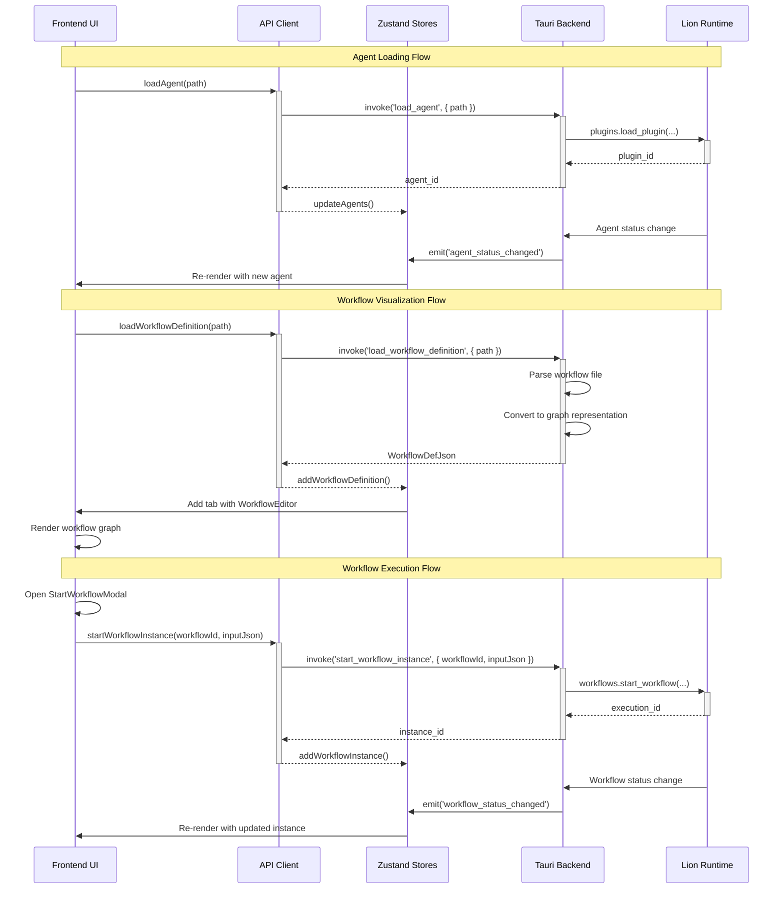

# LionForge IDE - Design Document: Stage 3 Phase 2 - Core Execution, Agent Management & Workflow Viewing

**Version:** 1.0 **Date:** 04/03/2025 **Author(s):** @Designer **Status:** Proposed

## 1. Introduction & Goals

This design document outlines the implementation of Stage 3 Phase 2 of the LionForge IDE, which focuses on transitioning from a purely observational tool to one that allows basic control over core entities. This phase will enable users to load/unload agents, view workflow structures, and initiate workflow execution, building on the foundation established in Phase 1.

### 1.1. Goals

- Enable users to load agents from WASM files or agent configuration files
- Allow users to unload agents that are currently running
- Implement workflow definition visualization as interactive graphs
- Enable users to start workflow instances with optional input data
- Provide real-time monitoring of workflow instance status
- Implement context menus in the Project Explorer for agent and workflow operations

### 1.2. Non-Goals

- Advanced workflow editing capabilities (deferred to Phase 3)
- Complex workflow debugging or step-through execution (deferred to later phases)
- Detailed workflow instance visualization with execution progress (basic status only in this phase)
- Advanced agent configuration or parameter tuning (basic loading only in this phase)
- Persistent workflow history beyond the current session

## 2. Proposed Design

### 2.1. Backend Design (Rust / Tauri Core)

- **State:** The Tauri backend will maintain the following additional shared state:
  - `Arc<WorkflowManager>`: Manages workflow definitions and instances
  - Enhanced `Arc<PluginManager>`: Extended to support loading/unloading agents

```rust
/// Workflow instance summary for UI display
#[derive(Debug, Clone, Serialize)]
pub struct WorkflowInstanceSummary {
    /// Unique identifier for the workflow instance
    pub instance_id: String,
    /// Name of the workflow (from definition)
    pub workflow_name: String,
    /// Current status of the workflow instance
    pub status: String,
    /// When the workflow instance was started
    pub start_time: String,
    /// Optional end time if the workflow has completed or failed
    pub end_time: Option<String>,
}

/// Filter for listing workflow instances
#[derive(Debug, Clone, Deserialize)]
pub struct InstanceFilter {
    /// Optional status to filter by
    pub status: Option<String>,
    /// Optional workflow name to filter by
    pub workflow_name: Option<String>,
    /// Maximum number of instances to return
    pub limit: Option<usize>,
}
```

- **Tauri Commands:**

```rust
/// Load an agent from a file (WASM or configuration)
#[tauri::command]
async fn load_agent(
    path: String,
    runtime: tauri::State<'_, Arc<Runtime>>
) -> Result<String, String> {
    // 1. Determine if path is WASM or config file
    // 2. If WASM, read bytes and load directly
    // 3. If config, parse configuration and load accordingly
    // 4. Call runtime.plugins.load_plugin(...) with appropriate parameters
    // 5. Return the assigned plugin_id as String
    // 6. Handle errors, map to String error message
    
    let file_extension = Path::new(&path)
        .extension()
        .and_then(|ext| ext.to_str())
        .unwrap_or("");
    
    match file_extension {
        "wasm" => {
            // Load WASM file directly
            let wasm_bytes = std::fs::read(&path)
                .map_err(|e| format!("Failed to read WASM file: {}", e))?;
            
            // Extract filename for agent name
            let filename = Path::new(&path)
                .file_stem()
                .and_then(|name| name.to_str())
                .unwrap_or("unknown_agent");
            
            // Load plugin with runtime
            let plugin_id = runtime.plugins.load_plugin(
                filename.to_string(),
                PluginSource::Wasm(wasm_bytes),
                None, // No specific config
            ).await
            .map_err(|e| format!("Failed to load agent: {}", e))?;
            
            // Emit event for UI update
            // (handled by existing agent_status_changed event)
            
            Ok(plugin_id.to_string())
        },
        "json" | "toml" => {
            // Parse agent configuration file
            // Implementation depends on configuration format
            Err("Agent configuration files not yet supported".to_string())
        },
        _ => Err(format!("Unsupported file type: {}", file_extension))
    }
}

/// Unload an agent by ID
#[tauri::command]
async fn unload_agent(
    agent_id: String,
    runtime: tauri::State<'_, Arc<Runtime>>
) -> Result<(), String> {
    // 1. Parse agent_id to PluginId
    // 2. Call runtime.plugins.unload_plugin(&plugin_id).await
    // 3. Handle errors, map to String error message
    
    let plugin_id = PluginId::from_string(&agent_id)
        .map_err(|_| format!("Invalid agent ID: {}", agent_id))?;
    
    runtime.plugins.unload_plugin(&plugin_id).await
        .map_err(|e| format!("Failed to unload agent: {}", e))?;
    
    // Emit event for UI update is handled by the runtime
    
    Ok(())
}

/// Load a workflow definition from a file
#[tauri::command]
async fn load_workflow_definition(
    path: String,
    runtime: tauri::State<'_, Arc<Runtime>>
) -> Result<WorkflowDefJson, String> {
    // 1. Read the file content (JSON or YAML)
    // 2. Parse it into lion_workflow::model::WorkflowDefinition
    // 3. Convert to WorkflowDefJson for frontend visualization
    // 4. Return the JSON structure
    
    let content = std::fs::read_to_string(&path)
        .map_err(|e| format!("Failed to read workflow file: {}", e))?;
    
    let file_extension = Path::new(&path)
        .extension()
        .and_then(|ext| ext.to_str())
        .unwrap_or("");
    
    // Parse based on file extension
    let workflow_def = match file_extension {
        "json" => {
            serde_json::from_str::<WorkflowDefinition>(&content)
                .map_err(|e| format!("Failed to parse JSON workflow: {}", e))?
        },
        "yaml" | "yml" => {
            serde_yaml::from_str::<WorkflowDefinition>(&content)
                .map_err(|e| format!("Failed to parse YAML workflow: {}", e))?
        },
        _ => return Err(format!("Unsupported workflow file type: {}", file_extension))
    };
    
    // Convert to frontend-friendly format with nodes and edges
    let workflow_def_json = convert_workflow_to_graph_json(&workflow_def)
        .map_err(|e| format!("Failed to convert workflow to graph: {}", e))?;
    
    Ok(workflow_def_json)
}

/// Start a workflow instance
#[tauri::command]
async fn start_workflow_instance(
    workflow_id: String,
    input_json: Option<String>,
    runtime: tauri::State<'_, Arc<Runtime>>
) -> Result<String, String> {
    // 1. Parse workflow_id
    // 2. Parse input_json into serde_json::Value if provided
    // 3. Call runtime.workflows.start_workflow(workflow_id, input_value).await
    // 4. Return the new ExecutionId
    // 5. Handle errors, map to String error message
    
    let input_value = match input_json {
        Some(json) => {
            Some(serde_json::from_str::<serde_json::Value>(&json)
                .map_err(|e| format!("Invalid input JSON: {}", e))?)
        },
        None => None
    };
    
    let execution_id = runtime.workflows.start_workflow(&workflow_id, input_value).await
        .map_err(|e| format!("Failed to start workflow: {}", e))?;
    
    // Emit event for UI update is handled by the runtime
    
    Ok(execution_id.to_string())
}

/// List workflow instances
#[tauri::command]
async fn list_workflow_instances(
    filter: Option<InstanceFilter>,
    runtime: tauri::State<'_, Arc<Runtime>>
) -> Result<Vec<WorkflowInstanceSummary>, String> {
    // 1. Apply filter if provided
    // 2. Call runtime.workflows.list_instances(filter).await
    // 3. Map internal instances to WorkflowInstanceSummary
    // 4. Return the list
    // 5. Handle errors, map to String error message
    
    let instances = runtime.workflows.list_instances(filter).await
        .map_err(|e| format!("Failed to list workflow instances: {}", e))?;
    
    let summaries = instances.into_iter()
        .map(|instance| WorkflowInstanceSummary {
            instance_id: instance.id.to_string(),
            workflow_name: instance.workflow_name,
            status: instance.status.to_string(),
            start_time: instance.start_time.to_rfc3339(),
            end_time: instance.end_time.map(|t| t.to_rfc3339()),
        })
        .collect();
    
    Ok(summaries)
}

/// Cancel a workflow instance
#[tauri::command]
async fn cancel_workflow_instance(
    instance_id: String,
    runtime: tauri::State<'_, Arc<Runtime>>
) -> Result<(), String> {
    // 1. Parse instance_id to ExecutionId
    // 2. Call runtime.workflows.cancel_workflow(instance_id).await
    // 3. Handle errors, map to String error message
    
    let execution_id = ExecutionId::from_string(&instance_id)
        .map_err(|_| format!("Invalid instance ID: {}", instance_id))?;
    
    runtime.workflows.cancel_workflow(&execution_id).await
        .map_err(|e| format!("Failed to cancel workflow: {}", e))?;
    
    // Emit event for UI update is handled by the runtime
    
    Ok(())
}
```

- **Tauri Events (Backend -> Frontend):**

```rust
/// Workflow instance status update event
#[derive(Clone, Serialize)]
struct WorkflowStatusUpdate {
    /// ID of the workflow instance
    instance_id: String,
    /// New status of the workflow instance
    new_status: String,
    /// Timestamp of the status change
    timestamp: String,
}
// Emitted when a workflow instance status changes: app_handle.emit_all("workflow_status_changed", payload)

/// Workflow definition loaded event
#[derive(Clone, Serialize)]
struct WorkflowDefinitionLoaded {
    /// ID of the workflow definition
    workflow_id: String,
    /// Name of the workflow
    name: String,
    /// Path to the workflow definition file
    file_path: String,
}
// Emitted when a workflow definition is loaded: app_handle.emit_all("workflow_definition_loaded", payload)
```

- **Internal Logic/Modules:**

1. **Agent Management (`agents.rs`):**
   - Enhanced to support loading agents from files
   - Handles WASM file loading and validation
   - Manages agent lifecycle (load, unload)

2. **Workflow Management (`workflows.rs`):**
   - Handles workflow definition parsing and validation
   - Manages workflow instances (start, cancel, list)
   - Converts workflow definitions to graph representation for UI

3. **Graph Conversion (`graph.rs`):**
   - Utility functions to convert workflow definitions to graph representation
   - Handles node positioning and edge routing for visualization

### 2.2. Frontend Design (React / TypeScript)

- **Components:**

1. **ProjectExplorer.tsx (Enhanced):**
   ```typescript
   /**
    * Enhanced Project Explorer component
    * Purpose: Displays project folder structure with context menus for agent/workflow operations
    * Props: None
    * State: Uses projectStore from Zustand, contextMenu: { visible: boolean, x: number, y: number, type: string, path: string }
    * API Calls: loadAgent(), loadWorkflowDefinition()
    * Event Listeners: None (store handles events)
    */
   ```

2. **AgentListView.tsx (Enhanced):**
   ```typescript
   /**
    * Enhanced Agent List component
    * Purpose: Displays a table of loaded agents with their status and action buttons
    * Props: None
    * State: Uses agentStore from Zustand
    * API Calls: unloadAgent()
    * Event Listeners: None (store handles events)
    */
   ```

3. **WorkflowEditor.tsx (New):**
   ```typescript
   /**
    * Workflow Editor component
    * Purpose: Displays a workflow definition as an interactive graph
    * Props: 
    *   - workflowDef: WorkflowDefJson
    *   - onStartWorkflow: () => void
    * State: 
    *   - selectedNode: string | null
    *   - zoom: number
    *   - pan: { x: number, y: number }
    * API Calls: None (uses props)
    * Event Listeners: None
    * Uses: react-flow for graph visualization
    */
   ```

4. **WorkflowInstancesView.tsx (New):**
   ```typescript
   /**
    * Workflow Instances component
    * Purpose: Displays a table of workflow instances with their status
    * Props: None
    * State: Uses workflowStore from Zustand
    * API Calls: listWorkflowInstances(), cancelWorkflowInstance()
    * Event Listeners: workflow_status_changed (via store)
    */
   ```

5. **StartWorkflowModal.tsx (New):**
   ```typescript
   /**
    * Start Workflow Modal component
    * Purpose: Modal dialog for starting a workflow with input data
    * Props: 
    *   - workflowId: string
    *   - isOpen: boolean
    *   - onClose: () => void
    *   - onStart: (inputJson: string | null) => void
    * State: 
    *   - inputJson: string
    *   - isValid: boolean
    * API Calls: None (uses onStart callback)
    * Uses: JSON editor component for input data
    */
   ```

6. **ContextMenu.tsx (New):**
   ```typescript
   /**
    * Context Menu component
    * Purpose: Reusable context menu for right-click operations
    * Props: 
    *   - visible: boolean
    *   - x: number
    *   - y: number
    *   - items: { label: string, action: () => void, disabled?: boolean }[]
    *   - onClose: () => void
    * State: None
    * API Calls: None (uses callbacks)
    */
   ```

7. **MainArea.tsx (Enhanced):**
   ```typescript
   /**
    * Enhanced Main Area component
    * Purpose: Container for the main content area with tabs
    * Props: None
    * State: 
    *   - tabs: { id: string, title: string, type: 'workflow' | 'welcome', content: any }[]
    *   - activeTabId: string | null
    * API Calls: None (child components make API calls)
    */
   ```

- **State Management:**

1. **Agent Store (Enhanced):**
   ```typescript
   interface AgentStore {
     agents: Agent[];
     isLoading: boolean;
     error: string | null;
     fetchAgents: () => Promise<void>;
     loadAgent: (path: string) => Promise<string>;
     unloadAgent: (agentId: string) => Promise<void>;
     updateAgentStatus: (id: string, newState: string) => void;
   }
   ```

2. **Workflow Definition Store (New):**
   ```typescript
   interface WorkflowNode {
     id: string;
     type: string;
     data: { label: string, [key: string]: any };
     position: { x: number, y: number };
   }

   interface WorkflowEdge {
     id: string;
     source: string;
     target: string;
     label?: string;
   }

   interface WorkflowDefJson {
     id: string;
     name: string;
     nodes: WorkflowNode[];
     edges: WorkflowEdge[];
     properties: Record<string, any>;
   }

   interface WorkflowDefinitionStore {
     definitions: Record<string, WorkflowDefJson>;
     currentDefinitionId: string | null;
     isLoading: boolean;
     error: string | null;
     loadDefinition: (path: string) => Promise<WorkflowDefJson>;
     setCurrentDefinition: (id: string) => void;
   }
   ```

3. **Workflow Instance Store (New):**
   ```typescript
   interface WorkflowInstance {
     instanceId: string;
     workflowName: string;
     status: string;
     startTime: string;
     endTime?: string;
   }

   interface WorkflowInstanceStore {
     instances: WorkflowInstance[];
     isLoading: boolean;
     error: string | null;
     fetchInstances: () => Promise<void>;
     startWorkflow: (workflowId: string, inputJson?: string) => Promise<string>;
     cancelWorkflow: (instanceId: string) => Promise<void>;
     updateInstanceStatus: (instanceId: string, newStatus: string) => void;
   }
   ```

4. **UI Store (Enhanced):**
   ```typescript
   interface TabInfo {
     id: string;
     title: string;
     type: 'workflow' | 'welcome' | 'project';
     path?: string;
     content?: any;
   }

   interface UIStore {
     tabs: TabInfo[];
     activeTabId: string | null;
     contextMenu: {
       visible: boolean;
       x: number;
       y: number;
       type: string;
       path: string;
       items: { label: string, action: () => void, disabled?: boolean }[];
     };
     addTab: (tab: TabInfo) => void;
     closeTab: (id: string) => void;
     setActiveTab: (id: string) => void;
     showContextMenu: (x: number, y: number, type: string, path: string, items: any[]) => void;
     hideContextMenu: () => void;
   }
   ```

- **API Client (`src/lib/api.ts`):**

```typescript
// Agent API
export async function loadAgent(path: string): Promise<string> {
  return await invoke('load_agent', { path });
}

export async function unloadAgent(agentId: string): Promise<void> {
  return await invoke('unload_agent', { agentId });
}

// Workflow API
export async function loadWorkflowDefinition(path: string): Promise<WorkflowDefJson> {
  return await invoke('load_workflow_definition', { path });
}

export async function startWorkflowInstance(
  workflowId: string, 
  inputJson?: string
): Promise<string> {
  return await invoke('start_workflow_instance', { workflowId, inputJson });
}

export async function listWorkflowInstances(
  filter?: { status?: string, workflowName?: string, limit?: number }
): Promise<WorkflowInstance[]> {
  return await invoke('list_workflow_instances', { filter });
}

export async function cancelWorkflowInstance(instanceId: string): Promise<void> {
  return await invoke('cancel_workflow_instance', { instanceId });
}
```

- **Event Handling (`src/lib/events.ts`):**

```typescript
// Enhanced with workflow events

// Custom hook for workflow status events
export function useWorkflowStatusEvents() {
  const updateInstanceStatus = useWorkflowInstanceStore(state => state.updateInstanceStatus);
  
  useEffect(() => {
    let unlisten: () => void;
    
    async function setupListener() {
      try {
        unlisten = await listen<{ instance_id: string, new_status: string }>(
          'workflow_status_changed', 
          (event) => {
            const { instance_id, new_status } = event.payload;
            updateInstanceStatus(instance_id, new_status);
          }
        );
      } catch (error) {
        console.error('Failed to set up workflow status listener:', error);
      }
    }
    
    setupListener();
    
    return () => {
      if (unlisten) {
        unlisten();
      }
    };
  }, [updateInstanceStatus]);
}

// Updated app events hook
export function useAppEvents() {
  useRuntimeStatusEvents();
  useAgentStatusEvents();
  useLogEvents();
  useWorkflowStatusEvents();
}
```

- **Data Flow:**

1. **Agent Loading Flow:**
   - User right-clicks on a file in ProjectExplorer
   - ContextMenu appears with "Load Agent" option
   - User clicks "Load Agent"
   - Frontend calls `loadAgent(path)` API
   - Backend reads file, loads agent, returns agent ID
   - Backend emits `agent_status_changed` event
   - Frontend AgentStore updates with new agent
   - AgentListView re-renders with the new agent

2. **Workflow Visualization Flow:**
   - User clicks on a workflow file in ProjectExplorer
   - Frontend calls `loadWorkflowDefinition(path)` API
   - Backend parses workflow file, converts to graph representation
   - Frontend receives WorkflowDefJson
   - UIStore adds a new tab with WorkflowEditor
   - WorkflowEditor renders the graph using react-flow

3. **Workflow Execution Flow:**
   - User clicks "Start Instance" button in WorkflowEditor
   - StartWorkflowModal opens for input data
   - User enters input JSON and clicks "Start"
   - Frontend calls `startWorkflowInstance(workflowId, inputJson)` API
   - Backend starts workflow, returns instance ID
   - Backend emits `workflow_status_changed` event
   - Frontend WorkflowInstanceStore updates with new instance
   - WorkflowInstancesView re-renders with the new instance

### 2.3. Data Models

- **Workflow Definition JSON:**
```typescript
interface WorkflowDefJson {
  id: string;
  name: string;
  nodes: {
    id: string;
    type: string;
    data: { 
      label: string;
      [key: string]: any;
    };
    position: { x: number, y: number };
  }[];
  edges: {
    id: string;
    source: string;
    target: string;
    label?: string;
  }[];
  properties: Record<string, any>;
}
```

- **Workflow Instance Summary:**
```typescript
interface WorkflowInstance {
  instanceId: string;
  workflowName: string;
  status: string;
  startTime: string;
  endTime?: string;
}
```

### 2.4. Architecture Diagram



## 3. Security Considerations

- **Agent Loading:** The backend must validate WASM files before loading them to prevent malicious code execution. This includes:
  - Validating the WASM module format
  - Checking for required exports and imports
  - Ensuring the agent doesn't request capabilities beyond what's allowed
  - Sandboxing the execution environment

- **Workflow Execution:** The backend should validate workflow definitions before execution:
  - Ensure all referenced agents exist and are loaded
  - Validate that the workflow structure is valid (no cycles, etc.)
  - Check that input data matches the expected schema
  - Limit resource usage for workflow execution

- **Input Validation:** All user inputs, especially JSON input for workflows, must be validated:
  - Validate JSON syntax
  - Check against schema if available
  - Sanitize inputs to prevent injection attacks

- **File Access:** The backend needs to restrict file access to appropriate directories:
  - Only allow loading agents from designated directories
  - Only allow loading workflow definitions from project directories
  - Prevent path traversal attacks

## 4. Performance Considerations

- **Graph Rendering:** Workflow graphs can become complex with many nodes and edges:
  - Implement virtualization for large graphs
  - Use efficient layout algorithms
  - Consider lazy loading of node details
  - Optimize rendering with React.memo and useMemo

- **Workflow Instance Listing:** Systems may have many workflow instances:
  - Implement pagination or virtual scrolling for the instance list
  - Allow filtering by status, name, etc.
  - Consider limiting the number of instances fetched by default

- **Agent Loading:** Loading WASM files can be resource-intensive:
  - Show clear loading indicators
  - Consider background loading for large files
  - Cache compiled modules when possible

- **Event Handling:** Many events may be emitted during workflow execution:
  - Batch updates when possible
  - Debounce UI updates for rapidly changing values
  - Consider selective updates rather than full re-renders

## 5. Alternatives Considered

- **Workflow Visualization:**
  - **Selected:** React Flow for its flexibility, performance, and active maintenance.
  - **Alternative:** D3.js for more customization. Rejected due to higher implementation complexity and steeper learning curve.
  - **Alternative:** Mermaid for simpler implementation. Rejected due to limited interactivity.

- **Agent Loading UI:**
  - **Selected:** Context menu in Project Explorer for intuitive discovery.
  - **Alternative:** Dedicated "Load Agent" button in Agent List View. Will be included as an additional option for discoverability.
  - **Alternative:** Drag and drop from file system. Deferred to a future enhancement.

- **Workflow Input Handling:**
  - **Selected:** JSON editor in modal dialog for flexibility.
  - **Alternative:** Form-based input based on workflow schema. Deferred to Phase 3 when more schema information is available.

- **State Management for Workflow Instances:**
  - **Selected:** Dedicated Zustand store with real-time updates via events.
  - **Alternative:** Polling for updates. Rejected due to unnecessary network traffic and potential delays.

## 6. Open Questions

- How should we handle version compatibility between agents and workflows?
- What is the best approach for positioning nodes in the workflow graph for optimal readability?
- Should we implement a caching mechanism for frequently used workflow definitions?
- How should we handle very large workflow definitions with hundreds of nodes?
- What level of error detail should be exposed to the user when agent loading or workflow execution fails?